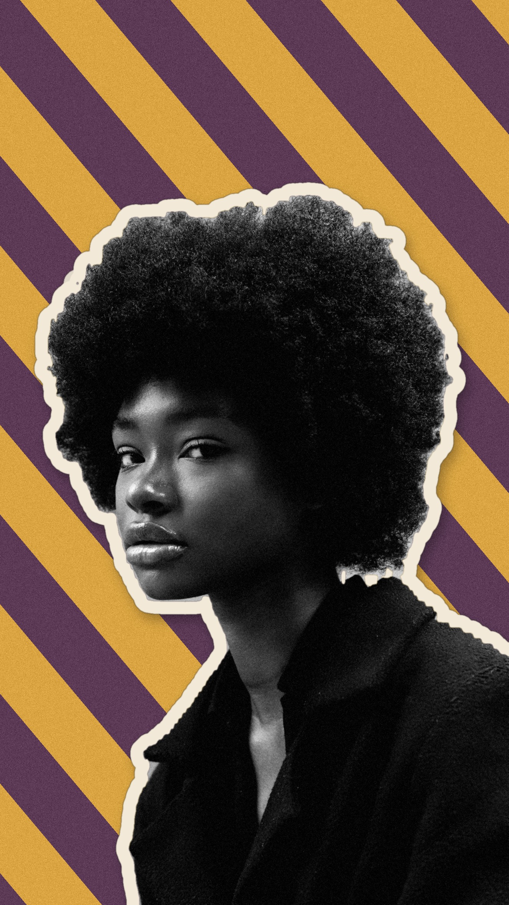
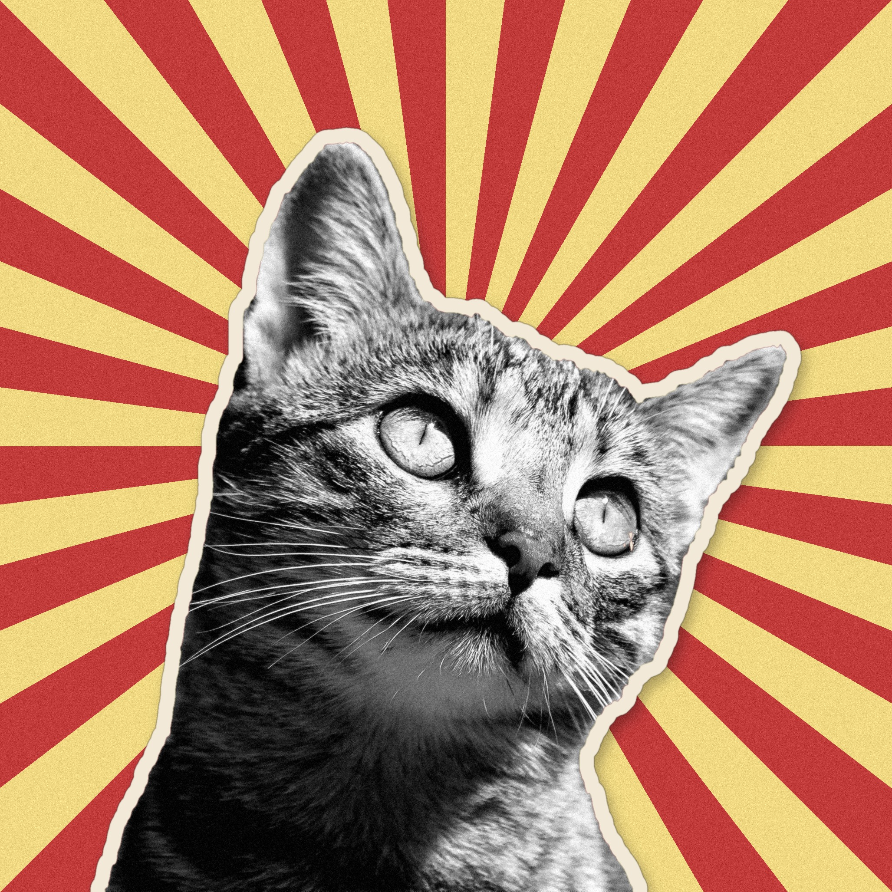
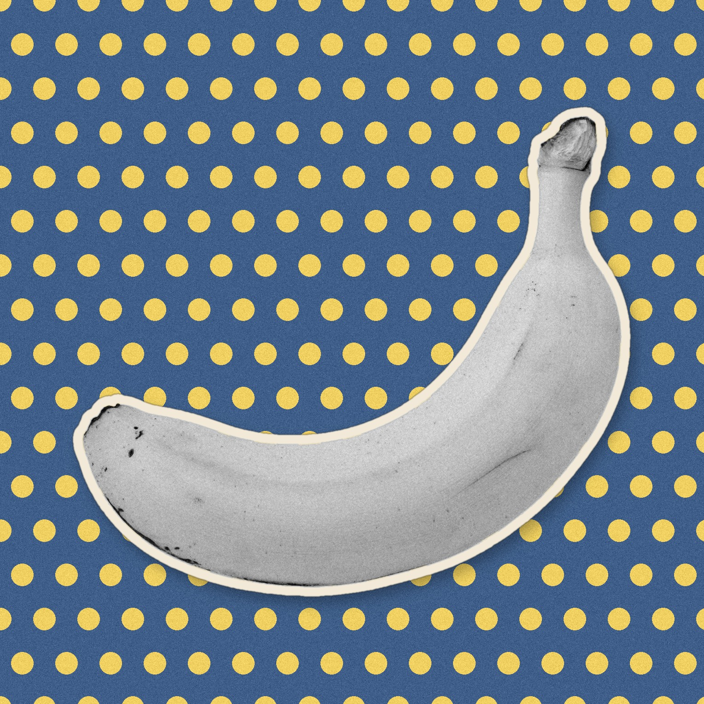
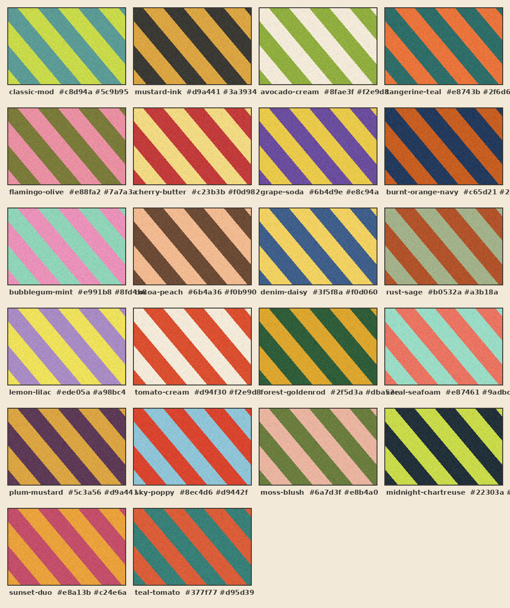

# Skills

A collection of Claude skills.

## retro-collage

Turn any photo into a retro collage / vintage zine sticker: the subject
(person, pet, food, product) is automatically cut out, treated like a grainy
black-and-white magazine clipping, traced with a cream sticker border, and
composited onto a bold 60s–70s patterned background — at any aspect ratio.

| | | |
|---|---|---|
|  |  |  |
| 9:16 · burnt-orange-navy | 4:5 · teal-tomato | 1:1 dots · denim-daisy |

Features: fully offline subject extraction (mediapipe → color-key → GrabCut
fallback chain), 22 named color palettes, three background patterns
(stripes / dots / sunburst), duotone tinting, flush-edge bleed for
frame-cropped subjects, resolution-proportional styling, and any output
aspect ratio with the subject filling ≥80% of the frame.

See [retro-collage/SKILL.md](retro-collage/SKILL.md) for usage, and
[retro-collage/references/palettes.md](retro-collage/references/palettes.md)
for the full palette library:

